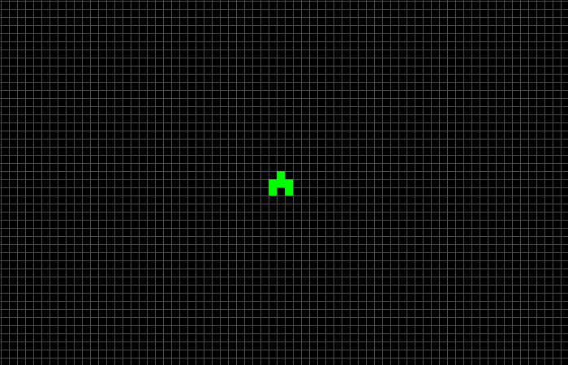
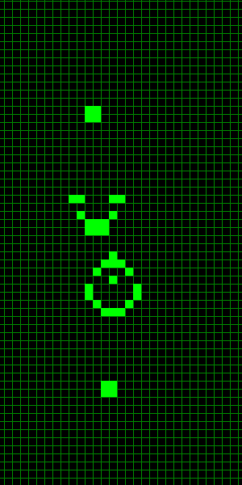

# Conway's Game of Life
The Game of Life is a cellular automata algorithm created by legend mathematician John Conway (RIP 2020)
Even though Dr. Conway hated all the attention given to his automata, it's still very cool to watch and very easy to code.

---

## The Rules

According to the source of humanity's knowledge a.k.a. Wikipedia the rules to the Game of Life are best described as follows:

> The universe of the Game of Life is an infinite, two-dimensional orthogonal grid of square cells, each of which is in one of two possible states, live or dead, (or populated and unpopulated, respectively). Every cell interacts with its eight neighbours, which are the cells that are horizontally, vertically, or diagonally adjacent. At each step in time, the following transitions occur:
>1. Any live cell with fewer than two live neighbours dies, as if by underpopulation.
>2. Any live cell with two or three live neighbours lives on to the next generation.
>3. Any live cell with more than three live neighbours dies, as if by overpopulation.
>4. Any dead cell with exactly three live neighbours becomes a live cell, as if by reproduction.

For some very simple initial conditions, the algorithm can generate very complex patterns. Here is an [amazing presentation published by the MIT](http://web.mit.edu/sp.268/www/2010/lifeSlides.pdf) which will give you more insight into why this algorithm is called the _Game of Life_.





### The Game of Life is... what is life?

_It is not immediately obvious whether a given initial Life pattern can grow indefinitely, or whether any pattern at all can.
Conway offered a $50.00 prize to whoever could setlle this question. In 1970 an MIT group headed by R.W. Gosper won the prize by finding the __Glider Gun__ (shown left) that emits a new glider every 30 generations. Since the gliders are not destroyed, and the gun produces a new glider every 30 generations indefinitely, the pattern grows forever, and thus proves that there can exist initial Life patterns that grow infinitely._

The Glider Gun along with other studied patterns, can be used to create (AND, OR and  NOT, and by combination, all) logic gates. This means we can build computers out of the Game of Life. I  don't know about you, but I find it mindblowing.

I guess it makes me wonder if what we call life on Earth (self-replicating DNA and RNA) is just a simple-rule automata with incredibly complex emerging patterns? 
Are we a cellular automata?
Are we a simulation? 
[`The Simulation Argument by Nick Bostrom`](https://www.simulation-argument.com/) explores this idea, I've found it to be a very well received topic of conversation at dates or family reunions (jk, best case scenario: boring and awkward, worst case scenario: crazy simulation-theory guy)

I hope you realize that I'm not a crazy simulation-theory guy, the reason I bring all this up is that I went through this realization while coding and playing the Game of Life, and I wanted to share this idea that complexity can emerge from simplicity, and that it can be applied to other fields like biology, chemistry, physics, etc..., to better understand our existence.

Or maybe this is just a lame justification for utiizing datacenter resources for hosting a sh*tty implementation of Conway's Game of Life, who knows? I hope this rabbit-hole inducing train of thought adds value to society in some way.

---

## How to play

### System Requirements
I developed and tested the application on an x86_64 system running a GNU/Linux distribution. 
You need the GNU toolchain `git, make, gcc, gdb, etc...` to build and test the application, so if:
1. You are already GNU/Linux user. I salute you, please continue to be awesome.
2. You are a macOS user. It is possible this works out of the box as long as you have the GNU toolchain installed in your system.
3. You are Windows user. I feel sorry for you, but I think it's possible to make this work with cygwin, or MinGW. I do not plan on supporting that, so if you plan to go that route, may god have mercy on your soul.

It might be best to follow the build instructions of the olcPixelGameEngine for your target platform and copy the Game of Life code to your Xcode or Visual Studio project or whatever. A good teacher once told me:
> _"Si quieres ser libre, usa software libre." — Ramiro Saldaña_

### The Creation of Life
The controls of this version of the Game of Life are:
<br>[MOUSE_LEFT_CLICK] — __Toggle__ a cell alive status
<br>[SPACEBAR] — __Resume/Pause__ the simulation
<br>[R_KEY] — __Reset__ and clear the simulation
<br>[Q_KEY] — __Quit__ the application

### Build and Run

```bash
# Clone the repository
$ git clone https://github.com/mcuan/conway.git
# Build the application
$ make all
# If succesful, it should output the executable file bin/x86_64/conway
$ file bin/x86_64/conway
bin/x86_64/conway: ELF 64-bit LSB pie executable, x86-64, version 1 (GNU/Linux), dynamically linked, interpreter /lib64/ld-linux-x86-64.so.2, GNU/Linux 3.2.0
# Run the application specifying number of rows and columns
$ ./bin/x86_64/conway ROWS COLS
```
By default cells are 10x10 px so if your screen resolution is 1920x1080p running the application like this, should fill your screen. (I don't like this... I might change it later, checkout [future improvements](#future-improvements))
```bash
$ ./bin/x86_64/conway 108 192
```

### if (Problems at compile time)
Check the Makefile and compiler flags to make sure you meet the library dependencies at compile time. 
```Makefile
CPPFLAGS = $(INC_DIRS) -MMD -MP --std=c++17 -g
LDFLAGS  = -lpthread   \
           -lX11       \
           -lGL        \
           -lpng       \
           -lstdc++fs
```
Of course you need all this libraries installed in a standard path for the linker to find and also a compiler that supports the C++17 standard, I was using `gcc version 10.1.0 (GCC)`. Normally, libraries are under `/usr/lib` directory but you can specify a diferent path using the linker flags (you'll have to add those to LD_FLAGS on the Makefile)

All of these are dependencies for the olcPixelGameEngine, so if you follow the instructions for your target platform you'll be fine.

### if (problems at runtime)

The executable has the following dynamic linker run-time bindings:
```bash
$ readelf -a bin/x86_64/conway | grep "Shared library"
Shared library: [libpthread.so.0]
Shared library: [libX11.so.6]
Shared library: [libGL.so.1]
Shared library: [libpng16.so.16]
Shared library: [libstdc++.so.6]
Shared library: [libm.so.6]
Shared library: [libgcc_s.so.1]
Shared library: [libc.so.6]
```
Matching versions may not be required, but make sure the linker can find them on the filesystem. Again, standard paths are `lib`, `/usr/lib`, but you can add more paths using ldconfig or setting `LD_LIBRARY_PATH` environment variable.

---

## The algorithm

Based on [the rules of the Game of Life](#the-rules) we iterate overy every cell of the grid and count its number of neighbors:

1. Iterate over all cells in the grid
2. Count number of neighbors (_oof... public shaming_)
```c++
int Conway::countNeighbors(std::shared_ptr<Cell> cell) {
  int count = 0;

  // Check top
  if (cell->y() > 0) {
    count += world[cell->y() - 1][cell->x()]->isPrevAlive() ? 1 : 0;
  }

  // Check bottom
  if (cell->y() < world.size() - 1) {
    count += world[cell->y() + 1][cell->x()]->isPrevAlive() ? 1 : 0;
  }

  // Check left
  if (cell->x() > 0) {
    count += world[cell->y()][cell->x() - 1]->isPrevAlive() ? 1 : 0;
    // Check top left corner
    if (cell->y() > 0) {
      count += world[cell->y() - 1][cell->x() - 1]->isPrevAlive() ? 1 : 0;
    }
    // Check bottom left corner
    if (cell->y() < world.size() - 1) {
      count += world[cell->y() + 1][cell->x() - 1]->isPrevAlive() ? 1 : 0;
    }
  }

  // Check right
  if (cell->x() < world[cell->y()].size() - 1) {
    count += world[cell->y()][cell->x() + 1]->isPrevAlive() ? 1 : 0;
    // Check top right corner
    if (cell->y() > 0) {
      count += world[cell->y() - 1][cell->x() + 1]->isPrevAlive() ? 1 : 0;
    }
    // Check bottom right corner
    if (cell->y() < world.size() - 1) {
      count += world[cell->y() + 1][cell->x() + 1]->isPrevAlive() ? 1 : 0;
    }
  }

  return count;
}
```
3. Apply 'Life' rules
```c++
// 1. Any live cell with fewer than two live neighbours dies, as if by underpopulation.
if (neighbors < 2) { 
  cell->setAlive(false);
}
// 2. Any live cell with two or three live neighbours lives on to the next generation.
if (neighbors == 2) {
  cell->setAlive(cell->isPrevAlive());
}
// 3. Any live cell with more than three live neighbours dies, as if by overpopulation.
if (neighbors > 3) {
  cell->setAlive(false);
}
// 4. Any dead cell with exactly three live neighbours becomes a live cell, as if by reproduction.
if (neighbors == 3) {
  cell->setAlive(true);
}
```
4. Repeat

---

## The game engine

For the Game of Life, I wanted to display stuff on the screen without having to deal with OpenGL and all the setup required to draw a couple of squares and lines. I figured there was no need to reinvent the wheel.

### OneLoneCoder
I used the `olcPixelGameEngine`: https://github.com/OneLoneCoder/olcPixelGameEngine
> olc::PixelGameEngine is a single file, cross platform graphics and userinput
framework used for games, visualisations, algorithm exploration and learning.

If you havent heard from `javidx9` and the OneLoneCoder community you are missing out on great content. I highly recommend checking out his Youtube channel https://www.youtube.com/javidx9. This guy is awesome at explaining stuff and created the olcPixelGameEngine with the help of the community he built on his channel.

#### Drawing

The library is super easy and intuitive to use, all the functions I needed for this application were:
```c++
// Clear screen
PixelGameEngine::Clear(Pixel p)
// Draw Lines
PixelGameEngine::DrawLine(int32_t x1, int32_t y1, int32_t x2, int32_t y2, Pixel p, uint32_t pattern)
// Draw Rectangles
PixelGameEngine::FillRect(int32_t x, int32_t y, int32_t w, int32_t h, Pixel p)

```

#### User input

There are also APIs to handle keyboard and mouse input
```c++
// Handle Keyboard input exxample
if(GetKey(olc::Key::R).bReleased) {
  running = false;
  conway.reset();
  refreshScene();PixelGameEngine::
}

// Handle Mouse input example
if(GetMouse(0).bReleased) {
  conway.world[mouse_y][mouse_x]->toggleAlive();
  refreshScene();
}
```

---

## Future improvements
Some things I'd like to add in the future:
- Drawing initial patterns. The ability to fill multiple squares at once by just dragging the cursor while holding the mouse left button.

- A Start Menu to specify configuration parameters such as the number of rows and columns. 
  - The Menu box should also be shown when pausing the Game. 
  - It should also show shortcuts to the keys to Pause, Restart and Quit the game.

- It would be cool to save your initial patterns and load them at runtime, so you can replay your favorite pattern animation and impress your friends (unlike me, you can avoid the awkward moment when you run the simulation with lame initial conditions were the pattern dies uneventfully after very few cycles)

Out of the box idea (but not really):
- Create a "ghost" of the previous `N` number of cylces, so that you can see how the pattern propagates through the grid after `N` generations.
  - Set the simulation to a finite amount of cycles, creating the "ghost" of all the previous cycles while interpolating a color palette for the "ghost" imprints. I think this will actually look really cool, like creating some digital psychedelic art. I will definitely give this a try in the future, but if you do before me, let me know how it goes!

- The ability to run the algorithm in a non-square grid (e.g. a honeycomb), with a different set of rules (This might not work, but maybe it does something really cool, who knows?)
